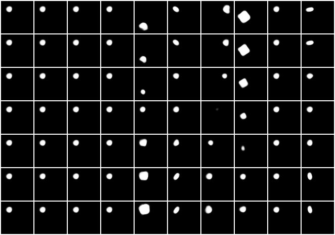

Latent traversals after training for 75 epochs. The traversals are constructed by obtaining the posterior of the first datapoint in the dSprites dataset, and then setting the invidual latents to values ranging from -3 to 3. Each column represents the traversal of one latent. 

The PyTorch version seems to work worse than Tensorflow's implementation, as it gives entangled reconsturctions. This is probably due to the fact that the authors of the original paper used Tensorflow in their experiments. Due to suddle differences between the frameworks, PyTorch's version likely needs an additional hyperparameter search. 

